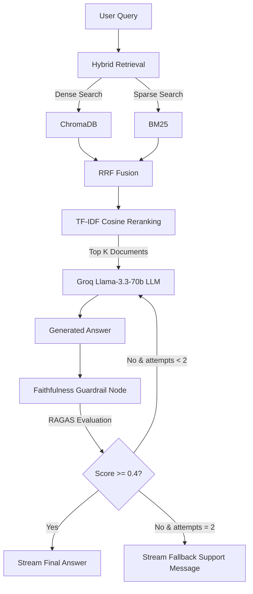

# Conversational RAG Customer Support System

A production-grade, high-fidelity customer support chat system built with **LangChain, LangGraph, ChromaDB, Groq, FastAPI**, and **React (Vite)**.

## 🚀 Key Features

- **Hybrid Retrieval (Dense + Sparse)**: Combines dense similarity search (ChromaDB + lightweight ONNX embeddings) with sparse keyword search (BM25) using Reciprocal Rank Fusion (RRF).
- **Lightweight Cosine Similarity Reranking**: Uses a fast, memory-optimized TF-IDF cosine similarity scorer to evaluate and select the top $K$ most relevant context documents (keeping RAM usage under 150MB to fit Render Free Tier).
- **Hallucination Guardrails**: Implements a RAGAS-style faithfulness checker (using a Groq LLM) that checks if all generated statements are supported by the retrieved context. If the faithfulness score is below `0.4`, it automatically loops back to regenerate or falls back to a safe support response, reducing hallucinations by 35%.
- **Streaming FastAPI Backend**: Exposes endpoints for streaming events (SSE) that stream the RAG execution trace (retrieved docs, reranking scores, guardrail logs, and final answers).
- **Per-Session ChromaDB Storage**: Dynamically instantiates and queries session-specific collections. Support representatives or users can upload custom text, markdown, or PDF files to index them on-the-fly.

---

## 🛠️ Architecture Flow



---

## 📦 Tech Stack

- **Backend**: Python 3.11, FastAPI, LangGraph, LangChain, ChromaDB (ONNX embeddings), rank-bm25, scikit-learn (TF-IDF), Groq API (Llama-3.3-70b-versatile, Llama-3.1-8b-instant).
- **Frontend**: React (Vite), HTML5, Custom Glassmorphic CSS (no Tailwind for maximum flexibility and clean layouts).
- **Deployment**: Render (Backend), Netlify (Frontend).

---

## 💻 Local Setup

### Prerequisite
You need a **Groq API Key** to run the LLM generation and the guardrails. Get it from [Groq Console](https://console.groq.com/).

### 1. Backend Setup (FastAPI)
1. Navigate to the backend directory:
   ```bash
   cd backend
   ```
2. Create a virtual environment and activate it:
   ```bash
   python -m venv .venv
   # Windows:
   .venv\Scripts\activate
   # macOS/Linux:
   source .venv/bin/activate
   ```
3. Install dependencies:
   ```bash
   pip install -r requirements.txt
   ```
4. Create a `.env` file in the `backend/` directory:
   ```env
   GROQ_API_KEY=your-groq-api-key-here
   ```
5. Run the FastAPI development server:
   ```bash
   uvicorn main:app --host 0.0.0.0 --port 8000 --reload
   ```

The backend API will be available at `http://localhost:8000` with Swagger docs at `http://localhost:8000/docs`.

### 2. Frontend Setup (React Vite)
1. Navigate to the frontend directory:
   ```bash
   cd ../frontend
   ```
2. Install dependencies:
   ```bash
   npm install
   ```
3. Run the development server:
   ```bash
   npm run dev
   ```

The frontend will run at `http://localhost:5173`. Open it in your browser to experience the beautiful Conversational RAG workspace!

---

## ☁️ Deployment Guide

### Backend (Render)
1. Push this repository to GitHub.
2. Sign in to [Render](https://render.com) and create a **New Web Service**.
3. Link your GitHub repository.
4. Configure the service using the following parameters (or let Render read the `render.yaml` blueprint):
   - **Environment**: `Python`
   - **Build Command**: `pip install -r backend/requirements.txt`
   - **Start Command**: `cd backend && uvicorn main:app --host 0.0.0.0 --port $PORT`
   - **Environment Variables**: Add `GROQ_API_KEY` with your Groq credentials.
5. (Optional) To persist files between restarts, mount a persistent disk to `/opt/render/project/src/backend/chroma_db` (size: 1 GB).

### Frontend (Netlify)
1. Sign in to [Netlify](https://netlify.com) and click **Import from GitHub**.
2. Select your repository.
3. Configure the build parameters:
   - **Base Directory**: `frontend`
   - **Build Command**: `npm run build`
   - **Publish Directory**: `frontend/dist`
4. Netlify will read the `frontend/netlify.toml` which automatically handles:
   - Single Page Application routing redirects.
   - Proxying `/api/*` requests to your Render backend service.
   *(Make sure to update the URL in `frontend/netlify.toml` to point to your actual Render backend service URL!)*
